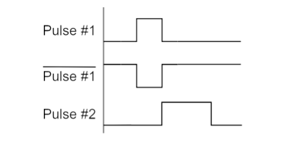
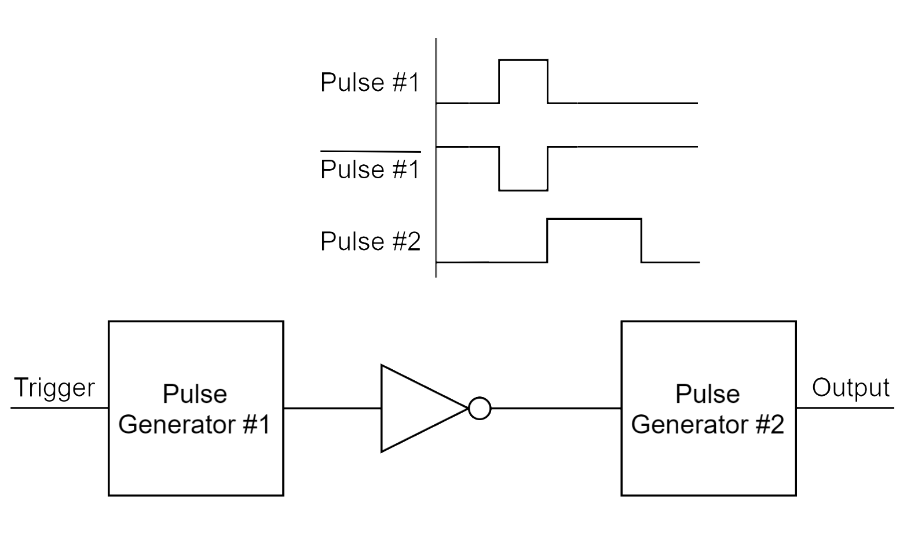
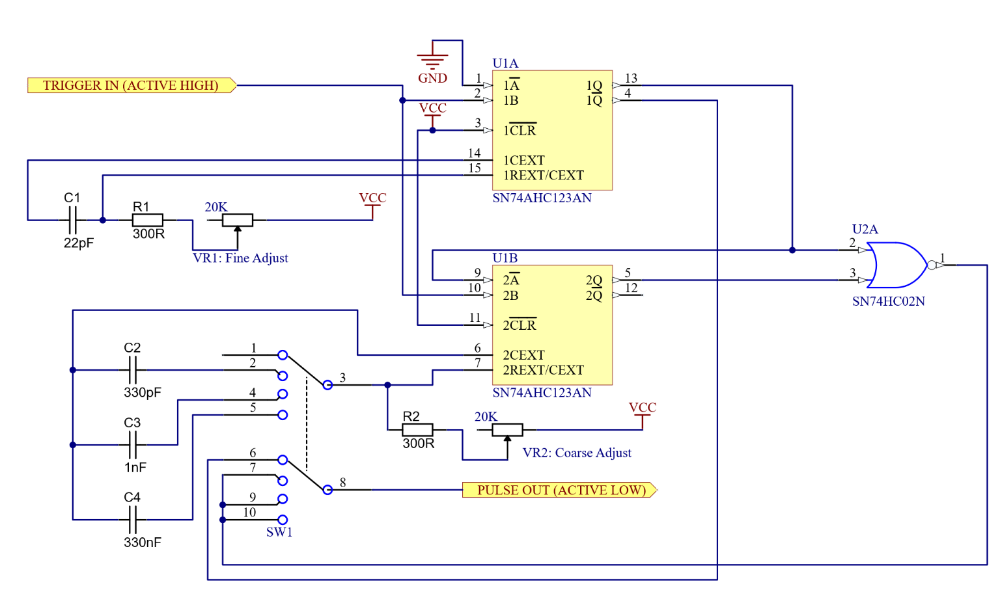
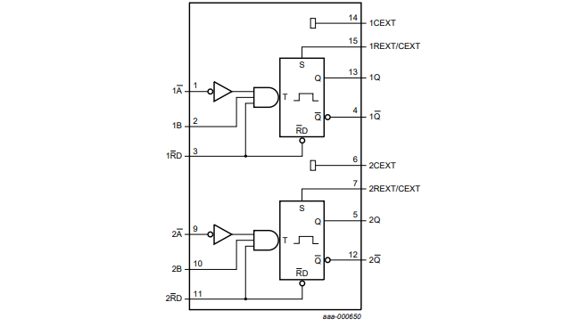
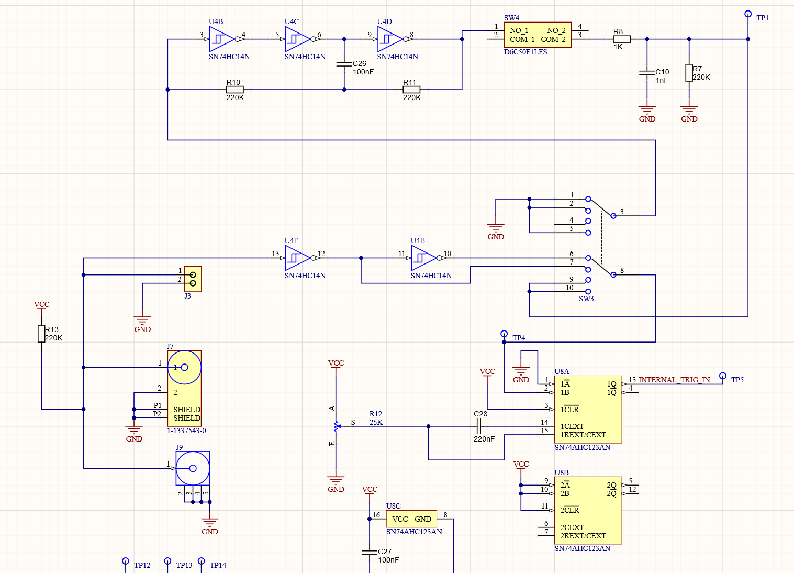

One method of performing voltage fault injection is to generate a signal that goes from the regular operating voltage to the “glitch” voltage. We want this glitch to exist at a certain point in time and at a certain delay from a trigger event. Typically this is generated by some sort of fancy digital logic - for example you can see our ChipWhisperer project which uses a programmable system to generate such a glitch.

But for basic operation, a simple classic delay using resistors and capacitors is enough. This kit is designed to produce such a glitch for you. We’ll discuss first the architecture, before looking at how to actually build the kit itself.

## Monostable Multivator Circuit
Let’s start with the question of how we could generate a signal indicating when and where to insert a glitch. This will be the delay & width logic.

The core of the delay & width logic is a pulse generator built using the SN74AHC123A (introduced July 1997, the original 74123 was introduced in 1983) monostable multivibrator. This device allows us to trigger on rising and falling edge pulses, and generate a specific output width pulse as set with a resistor-capacitor (RC) circuit.

{: .center}

Let’s consider that we have a trigger on the rising edge of the trigger signal, and this trigger generates Pulse #1 in the diagram. This Pulse #1 has an adjustable width.

If we invert Pulse #1, we get another rising edge that now exists at a point delayed from the original rising edge of the trigger signal. So we now have a second trigger, delayed from the original trigger by however wide Pulse #1 is.

We now generate Pulse #2, which again has an adjustable width. Pulse #2 is our glitch output.

So by using two “adjustable pulse generator” blocks in series it allows us to generate first a pulse with a specific delay from the initial trigger edge, and then a pulse with a certain width. This means we can generate a width and delay dependent on the individual pulse generator settings. Buy using adjustable RC values to adjust each pulse width, we now have an adjustable width and  delay from the trigger event.

This is shown in a diagram below:

So what does each pulse generator look like? Each pulse generator is built with a multivator circuit using the SN74AHC123A. We’ll jump right into the full trigger circuit here:

This is probably a little confusing - so let’s first check out the 74AHC123AN device itself. A basic block diagram is taken from the datasheet, and shown below:

The value of C and R set the output pulse width. If we want adjustable delay we’ll want to have an adjustable C or R value. From a practical standpoint, it’s easier to have an adjustable resistor than an adjustable capacitor.

Our goal here is to insert faults on specific cycles of the target device. This means we actually would like an ability to shift the pulse around on a very small time-scale to target specific operations, meaning adjustments in the range of hundreds of nanoseconds. But at the same point we may need to offset where the fault occurs from the trigger on a larger time-scale, as the device may perform many operations before we reach our specific operation of interest, which could mean waiting tens or hundreds of microseconds. For this reason the architecture has both a fine and a coarse adjustment method for the pulse delay and pulse width.

But this gets tricky, as if you want a large range (say 100 nS to 1 mS), how do you accomplish that with any meaningful adjustment range? A single variable resistor would be impossible to adjust between 100 nS to 200 nS for example in this case, since 100nS is just 0.01% of the full-scale setting of 1 mS!

Instead we use one monostable multivibrator (U1A) to trigger the second (U1B) – the first delay is used for the fine adjust, and after the fine adjust delay is over it triggers the long adjust delay. We combine the two outputs to form a single large pulse. As the SN74AHC123A contains two monostable multivibrators, we can implement the two delays using one chip. The schematic diagram for a single delay block (with both fine and coarse adjust). Note a limitation of this design is the trigger input must be held high long enough for the second multivibrator to trigger – very narrow triggers won’t work. We’ll do some input conditioning to help ensure we get a proper trigger.

With U1B, it has several ranges selected with switch SW1. This switches capacitor C2/C3/C4 onto the variable resistor VR2. Because the 74AHC123AN requires a minimum external resistor of at least 250 Ω, there is a series resistor R2 as well, which should be in the ~300 Ω range (the final board uses 330 Ω as it is more likely to be on-hand).

The SW1 is “ganged” - basically two switches that work in unison. This is used to select either the output 1Q of U1A (this is an ‘active low’ output), or the output of the NOR gate U2A. The NOR gate combines the two outputs from U1A and U1B, which effectively gives you a combination of the two (fine and coarse) adjusts.

Our overall delay has a two SN74AHC123A – the first implements the ‘offset delay’ (Pulse Generator #1 from Figure 2), and the second implements the ‘pulse width’ (Pulse Generator #2 from Figure 2). Both the offset and width have coarse and fine adjusts.

One minor difference between the two blocks, is that on the second block, it uses an ‘active low’ trigger input.
ChipJabber Detailed Description

Let’s go back to our beginning to examine the circuit in detail. We’ll discuss the input conditioning, the delay and width generator, the output mux, and the voltage regulator circuit.

## Input Conditioning

SW3 is used to select a “trigger source”. You can see that pins 6 & 7 of the switch SW3 come from the input terminals, where the inverters are used to select a rising-edge or falling-edge trigger.

The other two options on SW3 come from a push-button. Because push-buttons have some bounce, we use capacitor C10 and resistor R8 to help debounce the push-button. This will provide a more clean logic signal.

When you press the push-button, you are making the two metal-contacts touch each other. From the outside, it may look like that the contacts have closed instantly but internally the switch will bounce between the in-contact and open state. As a result, the pressed switch will not provide a clean edge. In our case, this causes many high signals/counts rather than the one desired signal. To bypass this problem, the switch can be debounced using many debouncer circuits and one such circuit is shown below. Here, the low pass filter from the series RC will filter out any glitches produced by the switch. 

The input to the push-button can be either a constant logic level, or an oscillator running at around XXX Hz. The oscillator is made by the three inverting gates at U4B, U4C, and U4D. 

In the inverter oscillator, U4D is a schmitt trigger oscillator which is being operated by the series RC circuit. The capacitor is providing its input voltage, therefore, the U4D inverter’s job is to charge it when its voltage falls below the threshold value and the oscillator’s output goes high. In the same way, the inverter will discharge the capacitor when its voltage goes above the threshold, and the oscillator's output goes low. The SW3 can close and hold the inverter in a specific state by grounding the input of U4B. This is similar to your concepts about pull-up resistors. The state of U4B would be defined by the capacitor voltage which is acting as a supply voltage to the pull-up resistor R10.

To properly trigger the pulses, our “trigger” needs to last as long as the sum of the delay + pulse width. We thus do some preconditioning on the input trigger, as the input trigger may be a narrow glitch (that would not last that long). This conditioning is provided by U8A. The circuit serves as a pulse stretcher, with R12 & C28 setting the pulse width. If R12 is adjustable, then we can ensure the total delay is as long as we possibly need.

From here, we can trigger the circuit that generates the actual pulse to be inserted. Let’s take a look in detail

## Pulse Circuit

The external capacitor C1 and external resistor R1 are responsible for controlling the pulse duration of U1A. They adjust the frequency to be more than one-half of the input frequency. The output 1Q goes to high voltage level when the input pulse transitions from low to high. At regular intervals, the input continuously toggles to low level from high and then back to high. This repeated switching will maintain the output 1Q at high level, and this in turn sets the 2A input high, triggering U1B. The overall configuration results in the output from NOR gate U2A to be high and from pin1Qof U1A to be low. The switch SW1 can be used to continuously move its contacts with1Q pin of U1A and the output pin 1 of U2A. This continuous switching between high and low pulses will trigger the second pulse circuit. 

## Output Driver

Initially, when your trigger input from U4A is low, the output of U2C is inverted according to the NOR gate.This results in the capacitor C9 having the same voltage level at both of its plates. Which makes the output of U2D produce a low voltage, and thus the LED does not glow. However, as soon as high trigger input comes, the output of U2C changes to low and changes the voltage of the left plate of C9 as well. 

Now, you see that the capacitor gets a discharging path and its plates come at low level along with the input of U2D. As a result, the output of U2D goes high and the LED lights up. In the meanwhile, the capacitor is again charging up and the output of U2D goes low, and this low level is also being fed back to input of U2C. This systematically resets the state of the pulse stretcher and it is ready again to stretch the input pulse as long as the capacitor is charging. This blinks the LED1 at a human length. 

MAX4619 has three single pole double throw (SPDT) switches and one such SPDT switch has input at pin 4 and outputs at pin 3 and pin 5. The pin 3 is connected with VNORMAL and pin 4 with VGLITCH. When you will toggle the switch at pin 4, it switches its contacts between the output terminals thus causing the switching between VNORMAL and VGLITCH.

## Power Supply

To provide reverse polarity protection; we have connected at Q2 a P-MOSFET with a zener diode. The zener diode is used to protect the P-MOSFET against high Vgs voltage. The input voltage Vin causes the P-MOSFET to turn on and starts the current flow as the Vgs voltage is negative.  For instance, when the Vin has a reverse polarity or you have connected it in the wrong way, the gate voltage will be positive and since P-MOSFET can only turn on with negative gate voltage, the P-MOSFET will turn off. Furthermore, the P-MOSFET results in less voltage drop than a simple diode solution, because there is a negligible turn-on resistance between its source and drain terminals. This also allows efficient and safer protection. 

U6 and U7 are low dropout (LDO) voltage regulators that only draw a maximum of  220 µA of quiescent current; to provide a high output current of 500 mA and low dropout voltage of only 210mV for its operation. The output voltage can be regulated by the adjustable pin 5 to ensure a reliable output. An error amplifier inside the LDO controls the voltage drop across an internal P-MOSFET to regulate the output voltage. If the load current decreases and the output voltage starts to increase, it will cause the error voltage to increase, which will be negatively fed back to reduce the P-MOSFET’s conductivity. As a result, the output voltage will start to decrease and return back to its normal value. The total power dissipation of U6 or U7 can be calculated using summation of its internal power dissipation and power dissipation due to its quiescent current. However, the power dissipation to its quiescent current is very small and you can neglect it. While the Vin maximum voltage of U6/U7 is only 6.5 V, you cannot connect 4 AA batteries (1.5 V each) in series to get the required voltage. As when they are new they produce high voltage, which may be too high for the system. The input power jacks J4 and J8 are connectors which will supply DC power to the electronic components. There is also a built-in switch that can turn off the battery when power is plugged in. 

