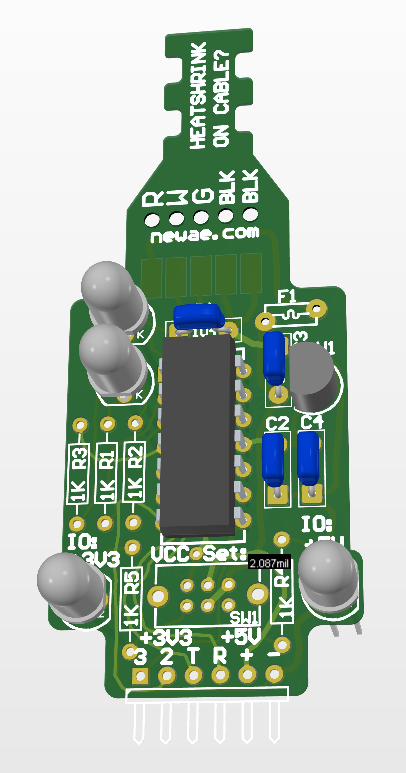

The DIPUSB converter will be used to interface to embedded systems.

## USB & Serial Background

Serial communications is one of the most common forms of talking with embedded systems. We’ll be using serial communication to communicate with the example target, as well as with the development board you can attack.

The ultimate goal of any communications protocol is to send data between A to B (typically two devices). There are lots of protocols out there - you’ve probably heard of USB, Ethernet, WiFi, etc. For talking directly to your computer USB (‘Universal Serial Bus’) is common.

## About USB

At a high level, USB has the advantage of much more overhead (control flow) that helps your computer understand what sort of device is attached. This helps your computer load the correct driver and (hopefully) the device can work with minimal fuss.

USB is available in several versions - notably 1.1, 2.0, and 3.0. They have different names as well, but USB 3.0 you might be familiar with the ‘Type-C’ connector now widely used by phones and similar. The following description will apply only to USB 1.1 and 2.0.

USB 1.1 comes with high and low bandwidth rates of 12 Mbits/s and 1.5 Mbits/s, respectively. However, USB 2.0 is an improvement and offers a high-speed bandwidth of up to 480 Mbits/s. USB 1.1 was introduced to fix the issues associated with its 1.0 version such as limited power and timings linked to the hub. But, USB 2.0 added the latest innovative attributes in USB such as USB On-The-Go to make two USBs communicate with each other without the usage of individual USB hosts. An example USB frame is shown below.

On the cable, USB uses four wires (again, this doesn’t apply to USB 3.0 which uses a different signalling method). These four wires are ground, +5V, “data plus” (DP or D+), and “data minus” (DM, or D-).

Let’s start with the basics: where does ground  +5V come from? Ground and +5V are provided to the device from the USB host (your computer). Easy enough right?

## USB Power

The actual USB standard defines two important things: how much total current a device can take, and how much “inrush charge” a device can take. The total current consumed has a hard limit of 500 mA (special signals are used when the +5V is supplied by a charger that can deliver higher currents, such as 2.1A). But despite what those cheap USB fans you plug into your computer suggest, you cannot just take 500mA directly from the +5V line. You Are supposed to ask permission, via the process (called enumeration) that tells the computer what is attached.

In practice, so many bad devices exist that simply draw the full 500mA without enumeration, few host devices will throw an error. But you may have seen an error such as “USB surge detected” if you ever plugged in a shorted device for example, so the hosts do still monitor the consumption (or they should).

OK, so what is the inrush limit then? The USB specification defines that a device plugged into the USB port should have no more than 10uF of capacitance “on connect”. This is done because the capacitor will charge up quickly on connection, and will take far more than the “allowed” 100mA for a short time while the capacitor charges.

You can use a circuit that slowly increases the resistance should you have more than 10uF of capacitance. Luckily we can be lazy with our board, since it won’t have more than the allowed 10uF of capacitance on the +5V line.

In fact - the USB specification does list a minimum capacitance you should have of 1uF. Why have a minimum at all though? A few reasons - but the main reason the specification defines one, is that a long USB cable is effectively an inductor:

FIGURE XXXX

One property of inductors is they don’t like to have a changing current through them. If an inductor (such as the USB cable) is passing 200mA, and the current suddenly stops, the voltage on the inductor will rise to oppose the changing voltage.

This happens because the inductor stores power in its magnetic field, just like a capacitor stores energy (in the capacitor it’s stored in an electric field). When the field collapses the energy needs to go somewhere - the stored energy doesn’t need to go home, but it can’t stay there.

You might have seen this already if you’ve driven a relay - there is almost always a diode that “catches” the voltage, and gives a path to close the circuit and dissipate the energy in the inductor itself. We don’t have such high inductances, so a small (in this case 1uF) capacitor similarly provides a “path” for that rising voltage to pass through (and the energy be absorbed).

This will happen when one end of the cable is unplugged. If you unplug the computer end, the device end may see a rising voltage due to the inductance of the cable.

## USB Data

The USB data is sent over a “differential” mode. Differential signalling electrically transfers a series using two complementary signals over two wires, D+ and D-. This differential signalling can boost the signals strength while reducing noise in low voltage electronics. When data is received at its destination, the receiver analyzes the D+and D- signal potential difference to extract the information. The figure shown below depicts how data is sent over using a differential pair. 

## About Serial

The Universal Asynchronous Receiver/Transmitter (UART) is the peripheral that performs the transmission of data across the bus. Serial communication can receive or transmit information one bit at a time. A serial bus uses two wires for transmission, one is for transmitting the signal (TX pin) and another for receiving it (RX pin). 

The most common hardware implementations of serial communication are using transistor-transistor logic (TTL) and RS232 signaling. Low-level ICs and microcontrollers use TTL level for serial communication. Their voltage supply ranging from 0 to 5V defines the TTL serial signals. 

Traditional peripherals and computers use RS-232 signalling which is opposite to TTL serial. These signals usually have a value between -13V and 13V, but you will see that its specifications will permit you to go as high as 25V and as low as -3V. Being opposite to TTL serial, if you are sending a low voltage level, it will mean a stop bit, an idle line or a 1 bit value. And, a high voltage level will mean a start bit or a data bit of 0 value. 

The baud rate, usually measured in bits-per-seconds (bps), defines the speed of your data over a serial line. You can take the inverse of baud rate if you want to know the transmission time of one bit. In other words, if you want to know how long the serial line was at a high or low voltage. The standard baud rate is 9600 bps but 1200, 2400, 19200 are also popular. The higher the baud rate, the higher will be the transmission speed but there is a limit to it, thus you cannot make it go beyond 115200. For example, the figure below depicts a signal waveform for 1 second between start and stop points. You can see that 8 bits are being transferred in 1 second, therefore, its baud rate will be 8 bps.

## USB-Serial Adapter

Our architecture is built around a Microchip MCP2221A device. This part provides a “bridge” between the USB lines and serial lines. In addition to normal serial lines, it provides some additional “general purpose I/O” lines that we can use to toggle additional pins - we’ll use this later for performing a reset of a target device for example.

If you look at a “normal” USB-serial device, it will often only have transmit (TX) and receive (RX) lines. You may find one with additional lines (called ‘flow-control’) that can also be used - the Arduino for example uses some of these additional flow-control lines to trigger the reset and similar. For Arduino you will normally use the DTR line.

The USB DP and DM lines are routed directly to the MCP2221A device. Our USB cable uses some quasi-standar colours. This has red & black as +5V and GND respectively, and white and green as XX and XX respectively. Watch out for the colour coding here - some of the top results when you search this have it backwards! If you’re ever unsure, you can always check from the cable itself. Here is a view looking into the cable end:

The MCP2221A  has an internal oscillator in it, meaning very few external components are required for this device to function. The only thing missing is the requirement of supplying 3.3V to some of the internal parts of the MCP2221A chip, which we need to derive from the +5V USB supply.

To accomplish this, a small 3.3V Low Drop-Out (LDO) voltage regulator is used at U1 - we discussed how LDOs work earlier when discussing the ChipJabber-Unplugged voltage regulator section.

This output voltage setting of the device can be either 5.0V or 3.3V. This allows us to interface with 5.0V and 3.3V serial ports. While many embedded systems are using the more standard 3.3V, you’ll still find some devices (such as Arduinos) working at 5.0V. Many automotive systems are also still using 5.0V, so even in real life you might find a use for the 5.0V setting.

!!! WARNING
    Some devices may use even lower voltages - 1.8V is not uncommon on some embedded systems nowadays, so if you are unsure always **_verify the maximum voltage being used_**.

Two LEDs indicate the output voltage setting. The red LED will indicate the higher 5.0V setting, and a yellow LED indicates the lower 3.3V setting. It’s important you pay attention to this voltage setting - using a 5.0V output with a 3.3V system is likely to cause damage to your target device!

